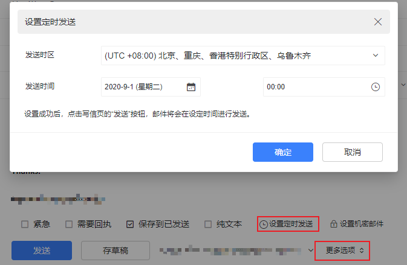
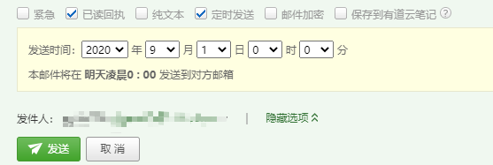

# 工作心得

## 工具篇

#### 邮件类

目标：每个人的时间都是有限的宝贵的，所以工作中能节省时间的技巧都是好技巧。

- **巧用：邮件定时发送**

    场景：日常工作中，写邮件、回复邮件的事情再普通不过了，但是还时不时会遇到一些问题，比如点击了发送邮件之后，立即或过了一会儿，想到邮件中的内容有错误、不完整、或语言表达还可以再润色一下等等。
    
    处理：这个时候，我们常常会出现焦急的心态，可能采取了以下的方案：
        
    * 立即再回复一封邮件，更正或补充上一封邮件的内容；
    * 撤销邮件，重新编写邮件，再发送；（前提是邮箱有撤销功能，和收件人都还未查看邮件）；

    但是上面的几种方案都不完美，重新回复邮件显得我们第一封邮件写的不仔细，而撤销方式也不能保证成功撤销。
    
    方案：这个时候，邮件定时发送就可以几乎完美的解决上面的问题：只要在预定的时间前发现邮件内容需要修改，及时再编辑邮件发送，就能避免出现上面的尴尬。
    
    有定时发送邮件功能的邮箱有：阿里邮箱、126邮箱等等。

    
    
    
   
- **巧用：邮件签名**

    场景：每次写邮件或回复邮件，末尾都要敲出自己的感谢、祝福语、联系方式等信息。
    
    处理：添加邮件签名，则在每一封新建邮件中会自动加上已定义的签名信息。

## 沟通篇

#### 消息类

- **发送一条简洁完整信息**

    场景：在跟同事沟通的过程中，难免会出现如下情况，沟通一个问题需要 N 多个来回。
    > 
      A: Hi, 在吗？
      B: z
      A: 有空么
      B: 有
      A: 有个问题想问你
      B: en
      A: 昨天的项目中，遇到了 xxx 问题。
      B: xxxx
    
    处理：沟通中，直接把自认为所有的信息一次性编辑完整再发送，再等待回复。
    > 
      A: Hi, 昨天项目中，遇到了 xxx 问题，你有空了，帮忙看一下。非常感谢！
      B: xxxx

#### 话语类
    
- **注意沟通语气：每个人都有自尊心，沟通中适当放低姿态，更容易达到沟通效果**

